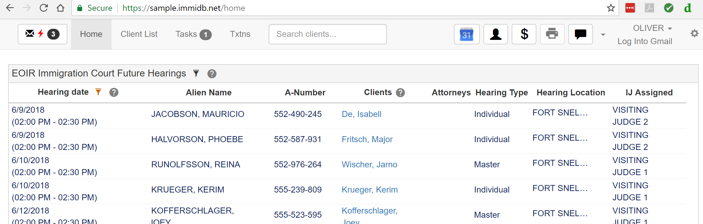
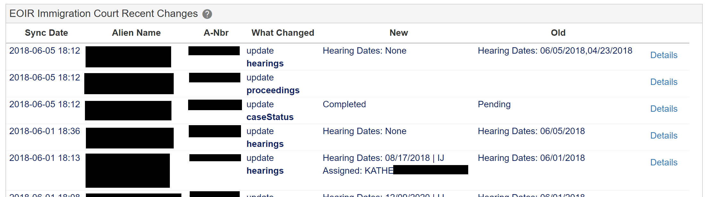
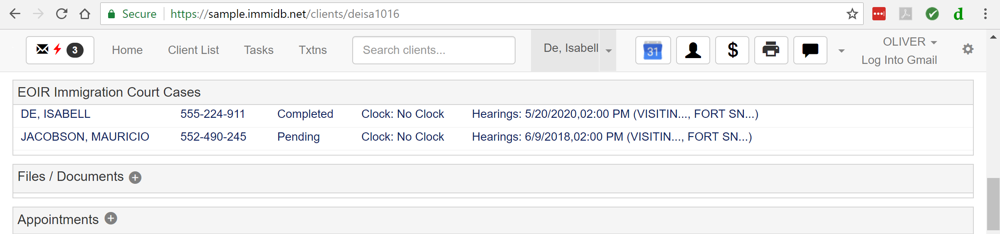
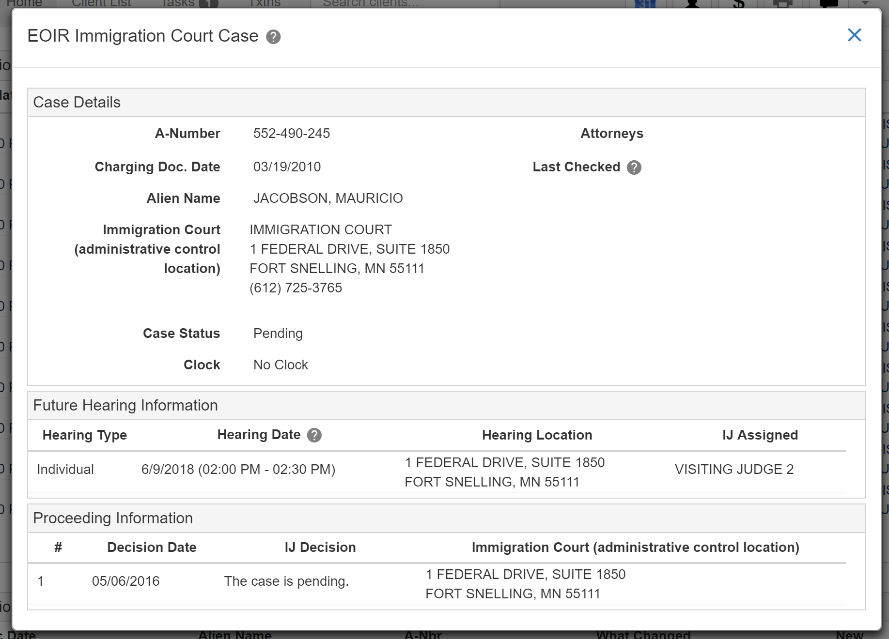

## ImmiDB How To

  [Change Client Status](#change-client-status) 
  [Delete a Client](#delete-a-client) 
  [Send an SMS Text](#send-an-sms-text) 
  [View EOIR Calendar](#view-eoir-court-calendar) 
  [View Recent EOIR Changes](#view-recent-eoir-changes) 
  [View EOIR Details For Client](#view-eoir-details-for-client)

### Change Client Status
Client Status includes 'Open', 'Closed' and 'Deleted'

1. Click Client Status to edit it. 

  
  

2. Click it again to see the dropdown options ('Open', 'Closed', 'Deleted')

  
  

3. Select the Client Status desired ('Open', 'Closed', 'Deleted')

### Delete a Client

1. Click Client Status to edit it. 

  
  

2. Click it again to see the dropdown options ('Open', 'Closed', 'Deleted')

  
  

3. Select 'Deleted'

    The client is marked as Deleted so it will not appear in searches or the client list.  It still exists in the database though and can be Un-deleted by returning to that client URL directly (you'll see a message indicating it is deleted) and then change the Client Status to 'Open' or 'Closed'.

### Send an SMS Text
An SMS text (typical phone text) can be sent if the Admin / Twilio has been set up by the database admin.

There are 2 ways in which an SMS Text can be sent.  
##### Send an SMS Text from the Nav Bar

  
  

##### Send an SMS Text by client phone number
When viewing a client who has phone numbers entered, hover over the phone number and click the SMS Text button when it appears. 

  
  

You can then enter/change the recipient phone number and message.  Any previous texts sent to that phone number are displayed at bottom in Text Message History. 

  
  

### View EOIR Court Calendar

The EOIR Court Hearings Calendar is displayed on the Home page. 

1. Click 'Home' in the top navigation.

    The EOIR Court Hearings Calendar will be displayed. 

  
  

  _(Randomly generated names, A-Numbers and data : does not reflect any real people)_

The 'Clients' column lists and links to the database clients and their derivatives that match on A-Number. 

Click any other column in a row to [see the EOIR details](#view-eoir-details-for-client).

See [Admin/Set Up EOIR](https://immidb.net/how_to_admin.html#set-up-eoir-integration) to set up EOIR and Attorneys for EOIR sync 

### View Recent EOIR Court Changes

The Recent EOIR Changes list is displayed on the Home page below the EOIR Hearings Calendar.  This shows the changes that have occurred within the last 20 days as detected by the EOIR sync process. 

Click 'Home' in the top navigation and scroll down to see the Recent EOIR Changes
  
  

The 'New' and 'Old' fields will give an abbreviated view of what changed.  Click 'Details' to see the full change details. 

Click any other column in a row to [see the EOIR details](#view-eoir-details-for-client).

See [Admin/Set Up EOIR](https://immidb.net/how_to_admin.html#set-up-eoir-integration) to set up EOIR and Attorneys for EOIR sync 

### View EOIR Court Details for Client

The EOIR details for a client can be displayed several ways. 

1. Click a row in the [EOIR Court Hearings Calendar](#view-eoir-court-calendar)
2. Click a row in the [EOIR Recent Changes](#view-recent-eoir-changes)
3. Click a row in the EOIR Immigration Court Cases on the Client page for a client (scroll down on the client page to that section)

  
  
    _(Randomly generated names, A-Numbers and data : does not reflect any real person)_

  If a client has EOIR information as matched by the A-Number directly for the client or any of its derivatives, those EOIR Court items will be listed in this section. 

  After clicking a row, the full details are displayed that have been pulled from the EOIR court site. 

  
  
 _(Randomly generated names, A-Numbers and data : does not reflect any real person)_

